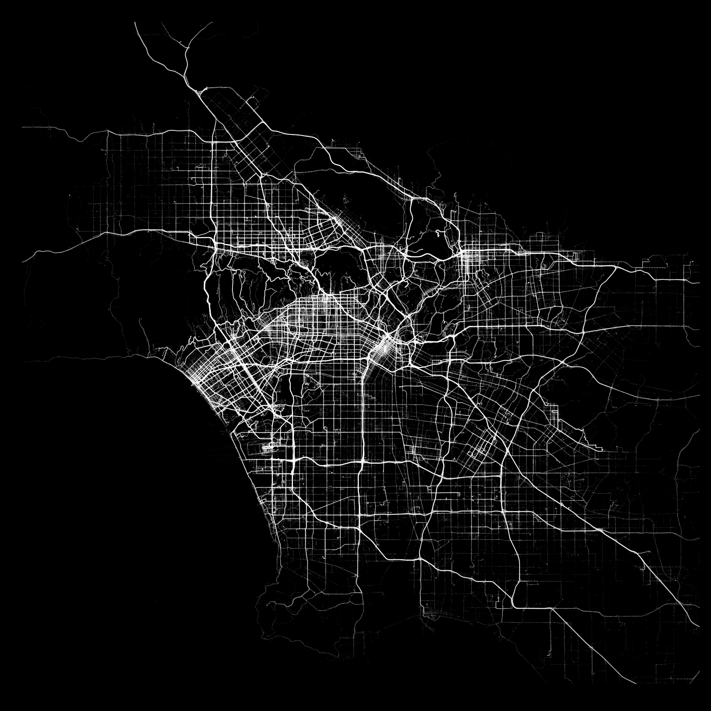

# Human Cities
Every day, people track millions of activities with Human. We visualized 7.5 Million miles of activity in major cities all across the globe to get an insight into Human activity. Walking, running, cycling, and motorized transportation data tell us different stories.

* Human Cities: http://cities.human.co
* How we built Human Cities in 10 days: http://blog.human.co/posts/human-cities.html

## Code examples
All GPS data is plotted in R, without any basemaps. 

* Plot images per city: [cityPlot.R](cityPlot.R)
* Plot frames for 24 hours of activity per city: [cityFrames.R](cityFrames.R)
* Some little terminal snippets: [snippets.sh](snippets.sh)

